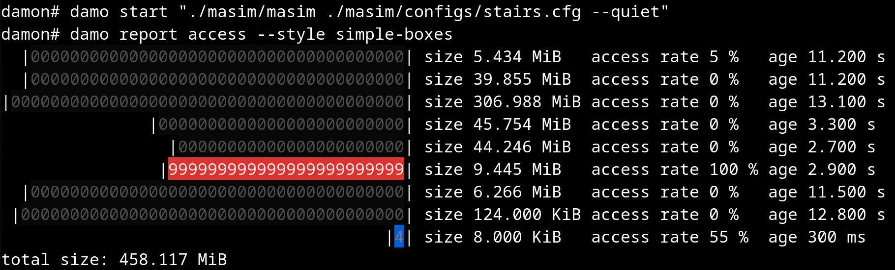
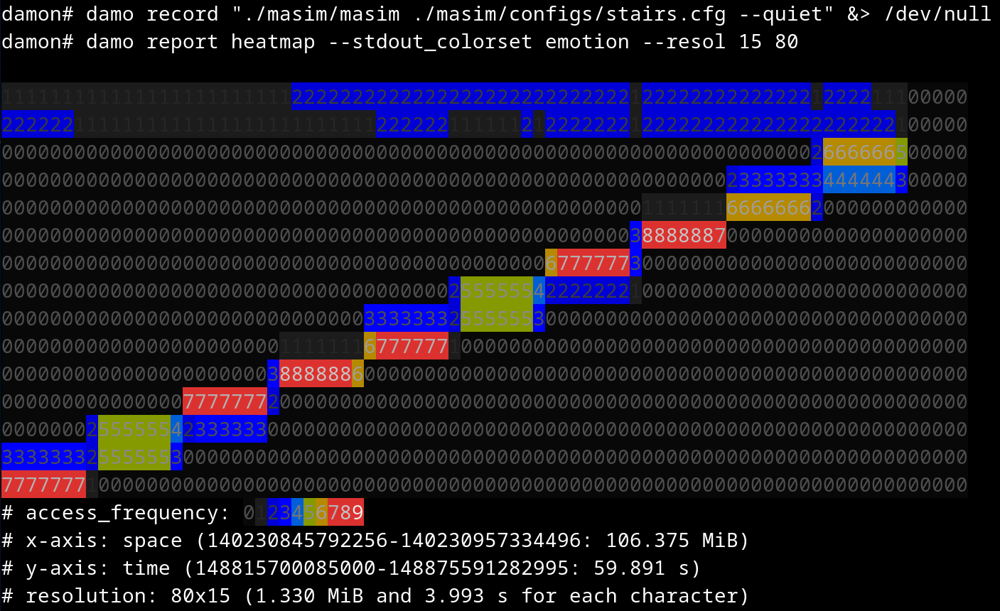

DAMO: Data Access Monitoring Operator
=====================================

`damo` is a user space tool for [DAMON](https://damonitor.github.io).  Using
this, you can monitor the data access patterns of your system or workloads and
do data access-aware memory management operations.


Official Repositories
---------------------

Official git repos for `damo` are hosted on kernel.org and GitHub:

- kernel.org: https://git.kernel.org/pub/scm/linux/kernel/git/sj/damo.git
- GitHub: https://github.com/damonitor/damo


Demo Video
==========

Please click the below thumbnail to show the short demo video.  Note that the
video is recorded in 2020, and hence not showing features added after the demo.

[](
http://www.youtube.com/watch?v=l63eqbVBZRY
"DAMON: a demo for the Kernel Summit 2020")


Getting Started
===============

[](https://repology.org/project/damo/versions)

Follow below instructions and commands to monitor and visualize the access
pattern of your workload.

    $ # install damo using packaging systems listed above,
    $ # or cloning the source repo and updating $PATH.
    $ sudo damo start $(pidof <your workload>)
    $ sudo damo report access
    $ sudo damo record ongoing
    $ sudo damo report heatmap --draw_range hottest

The second and last commands will show the access pattern of your workload,
like below:





FAQs
====

What kernels are supported by `damo`?
-------------------------------------

`damo` provides three categories of commands,
- for controlling [DAMON](https://damonitor.github.io) in kernel,
- for processing DAMON-generated outputs such as access monitoring output, and
- for misc helpers.

Commands not in the first category are independent to the kernel.

Commands of the first category depends on if DAMON features for the given
command is available on the running kernel.  Essential DAMON features are
available on kernels that built with `CONFIG_DAMON=y`.

If the system is configured in a way that necessary DAMON features are not
available, the `damo` commands will fail with messages informing the reason and
how you can get help, like below.

```
$ sudo damo start

DAMON is not available on this system.  Ask help to your sysadmin or DAMON
community.

To ask help to DAMON community, you can
- send a mail to the mailing list (damon@lists.linux.dev),
- open a damo GitHub issue (https://github.com/damonitor/damo/issues), or
- send a mail to DAMON maintainer: sj@kernel.org
```

Follow the recommendation in the message for help.  Again, note that only
commands in the first category depend on the kernel.

To see if DAMON is available on your system without running such commands,
`damo report sysinfo` can be used.  If the output of the command shows `DAMON
version` as `<5.15`, DAMON is not available on the system.

For example, on a system that DAMON is not available:

```
$ sudo damo report sysinfo
damo version: v3.1.5-29-gad48ac5b
kernel version: 6.19.0-rc6-mm-new-damon+
DAMON version: <5.15
```

On a system that DAMON is available:

```
$ sudo damo report sysinfo --print versions
damo version: v3.1.5-24-gfc8c0e51
kernel version: 6.19.0-rc6-mm-new-damon+
DAMON version: 6.19+
```

If you unsure if your kernel enables DAMON or how to enable DAMON on your
kernel, please ask help to your kernel provider, or DAMON community.


Where can I get more detailed usage?
------------------------------------

The below sections provide quick introductions for `damo`'s major features.
For more detailed usage, please refer to [USAGE.md](USAGE.md) file.


What does the version numbers mean?
-----------------------------------

Nothing at all but indicate which version is more fresh.  A higher version
number means it is more recently released.

This also means that there is no special versions for hotfixes.  Instead, all
bug fixes and new features are released together in fast speed (nearly once per
week) under the single version scheme.  We also strive a high level of
stability across all versions.  Users are therefore recommended to use latest
version always if possible.  It is the only way to get all bug fixes and new
features.  If there is any problem at upgrading the version, please report an
issue.


Will the features of `damo` be supported forever?
-------------------------------------------------

We try our best to make `damo` stable and doesn't introduce regressions to
users.  However, nothing goes forever.  Sometimes, some features will be
deprecated.  Some features will have longer support more than others.

In short, features that documented on [USAGE.md](USAGE.md) and not explicitly
marked as experimental will be better supported, and provides at least three
months of deprecation grace period.  Within the grace period, users can ask
extension of the support.  Even after the grace period, please reach out to
`damo` developers if that makes problem to your usage.

Detailed features deprecation process is documented at
[FEATURES_DEPRECATION_PROCESS.md](FEATURES_DEPRECATION_PROCESS.md).  Schedules
and status of deprecations are updated on
[FEATURES_DEPRECATION_SCHEDULE.md](FEATURES_DEPRECATION_SCHEDULE.md).


How can I participate in the development of `damo`?
---------------------------------------------------

Please refer to
[CONTRIBUTING](https://github.com/damonitor/damo/blob/next/CONTRIBUTING) file.


Quick Intro for Major Features
==============================

Below are quick introductions for `damo`'s major features.
For more detailed usage, please refer to [USAGE.md](USAGE.md) file.


Snapshot Data Access Pattern
----------------------------

Below commands repeatedly get a snapshot of the access pattern of a program for
every second.

    $ git clone https://github.com/sjp38/masim
    $ cd masim; make; ./masim ./configs/zigzag.cfg --silent &
    $ sudo damo start --target_pid $(pidof masim)
    $ sudo damo report access --repeat

The first two lines of the commands get an artificial memory access generator
program and run it in the background.  It will repeatedly access two 100
MiB-sized memory regions one by one.  You can substitute this with your real
workload.

The third line asks ``damo`` to start monitoring the access pattern of the
process.  Finally, the last line retries a snapshot of the monitoring results
every second and show on terminal.


Recording Data Access Patterns
------------------------------

Below commands record memory access patterns of a program and save the
monitoring results in `damon.data` file.

    $ git clone https://github.com/sjp38/masim
    $ cd masim; make; ./masim ./configs/zigzag.cfg --silent &
    $ sudo damo record -o damon.data $(pidof masim)

The first two lines of the commands get an artificial memory access generator
program and run it in the background.  It will repeatedly access two 100
MiB-sized memory regions one by one.  You can substitute this with your real
workload.  The last line asks ``damo`` to record the access pattern in
``damon.data`` file.


Visualizing Recorded Patterns
-----------------------------

Below three commands visualize the recorded access patterns into five
image files.

    $ damo report heatmap --output access_pattern_heatmap.png --draw_range all
    $ damo report wss --range 0 101 1 --plot wss_dist.png
    $ damo report wss --range 0 101 1 --sortby time --plot wss_chron_change.png

The first command will create three files, namely `access_pattern_heatmap.png`,
`access_patern_heatmap.1.png`, and `access_pattern_heatmap.2.png`.

- ``access_pattern_heatmap{,1,2}.png`` will show the data access pattern of
  three address ranges nearby stack, `mmap()`-ed region, and heat in heatmaps,
  which shows when (x-axis) what memory region (y-axis) is how frequently
  accessed (color).
- ``wss_dist.png`` will show the distribution of the working set size.
- ``wss_chron_change.png`` will show how the working set size has
  chronologically changed.

Those similarly made with other realistic workloads are available [1,2,3].

[1] https://damonitor.github.io/test/result/visual/latest/rec.heatmap.1.png.html<br>
[2] https://damonitor.github.io/test/result/visual/latest/rec.wss_sz.png.html<br>
[3] https://damonitor.github.io/test/result/visual/latest/rec.wss_time.png.html


Data Access Pattern Aware Memory Management
-------------------------------------------

Below command makes every memory region of size >=4K that hasn't accessed for
>=60 seconds in your workload to be swapped out.  By doing this, you can make
your workload more memory efficient with only modest performance overhead.

    $ sudo damo start --damos_access_rate 0 0 --damos_sz_region 4K max \
                        --damos_age 60s max --damos_action pageout \
                        --target_pid <pid of your workload>

Holistic Memory Usage Monitoring
--------------------------------

You can also show access pattern heatmap, memory footprints, and hotspot
functions of the system and/or workloads all at once in live, like below.


